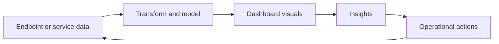

<!-- jr-brand:start -->
<div align="center">
  <a href="https://jannikreinhard.com/">
    
  </a>
  <h1>Power BI Dashboards</h1>
  <p><strong>Power BI dashboard templates for Microsoft Intune endpoint analytics and device management reporting.</strong></p>
  <p>
  <a href="https://jannikreinhard.com/"></a>
  <a href="https://github.com/JayRHa"></a>
  <a href="https://www.linkedin.com/in/jannik-r/"></a>
  <a href="https://x.com/jannik_reinhard"></a>
  <a href="https://www.youtube.com/@jannikreinhard"></a>
  </p>
  <p><sub>Driving AI with passion · Microsoft Foundry · Intune · Azure</sub></p>
</div>
<!-- jr-brand:end -->

## Overview

Power BI Dashboards turns endpoint or operational data into dashboards and reporting views for analysis and decision making.


## How It Works

Data is exported or connected, transformed into a report model, visualized in dashboards, then reviewed for trends, exceptions, and follow-up actions.



## Quickstart

1. Review the project context and workflow below.
2. Clone the repository:

   ```bash
   git clone https://github.com/JayRHa/PowerBIDashboards.git
   ```

3. Continue with the setup, usage, or workflow sections below.

## Intune Reporting Dashboard


## License

This project is available under the terms in [LICENSE](LICENSE).

<!-- jr-brand-footer:start -->

---

<div align="center">
  <p><sub>Built and maintained by <a href="https://jannikreinhard.com/">Jannik Reinhard</a> · Microsoft MVP for Security and AI Platform.</sub></p>
  <p><a href="https://www.buymeacoffee.com/jannikreinf">Support the open-source work</a></p>
  <p><strong>Stay healthy, Cheers Jannik</strong></p>
</div>

<!-- jr-brand-footer:end -->
